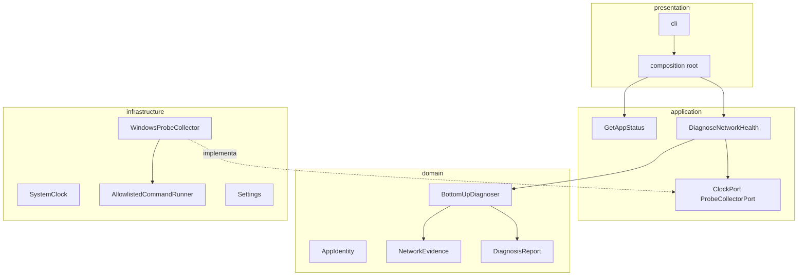

# Arquitetura Tecnica: Script Net Health

Arquitetura baseada em **Clean Architecture / Hexagonal** e **Domain-Driven Design (DDD)**.

Copilot NetOps: coleta probes no **host Windows** e diagnostica BOTTOM-UP a pilha TCP/IP de 4 camadas. Qualidade/git no WSL. Sem SSH para Cisco/MikroTik nesta fatia.

## Camadas

### Domain

`NetworkEvidence` (links com IPv4, pings com min/med/max/jitter, `ProbeTranscript`, throughput, TCP), `DiagnosisReport.as_text()` (formato obrigatorio NetOps), `BottomUpDiagnoser` + `tcp_layer_findings` (LAN/WAN/servico, path saudavel com camada `Nenhuma`). Sem IO e sem logs.

### Application

`DiagnoseNetworkHealth` + `ProbeCollectorPort`. `GetAppStatus` permanece em `--status`.

### Infrastructure

`AllowlistedCommandRunner` (sem shell), `WindowsProbeCollector` (ipconfig/ping/arp/route/netstat/nslookup/tracert), `probe_tcp` (porta 443 por default), `throughput_probe` (urllib GET/POST, Cloudflare se URL vazia), `probe_http` opcional, `Settings.from_env`.

### Presentation

Composition root em `presentation/cli/bootstrap.py`. Default: diagnostico. `--status`: identidade da app.

## Fluxo de diagnostico

1. Collector corre probes allowlisted com timeout e guarda stdout em `ProbeTranscript` (sem dump em INFO).
2. Parsers no adapter montam `NetworkEvidence` (RTT por amostras `time=`/`tempo=`; IPv4 da NIC).
3. Diagnoser aplica regras L1 a L4. Transporte usa perda/jitter e TCP; sockets LISTEN sao nota, nao criterio de OK.
4. CLI imprime o relatorio (resumo com Status; secao 5 com stdout integral) e emite `snh.diagnose.started|finished|failed`.

## Relatorio (`as_text`)

1. Resumo Executivo: Status (Saudavel/Falha/Degradado/Inconclusivo), impacto, camada so se houver falha (`Nenhuma` no path saudavel).
2. Analise por camadas TCP/IP com status `[ok|degraded|failed|unknown]`.
3. Causa raiz sustentada pelas probes.
4. Plano de acao.
5. Evidencias brutas: um bloco por comando com stdout integral.

## Configuracao

`.env` / `.env.example` com knobs `SNH_PROBE_*`, `SNH_ENABLE_SPEEDTEST`, `SNH_TCP_PROBE_PORT`, `SNH_TRACERT_TIMEOUT_SECONDS`. Testes: `SNH_DISABLE_DOTENV=1`.
